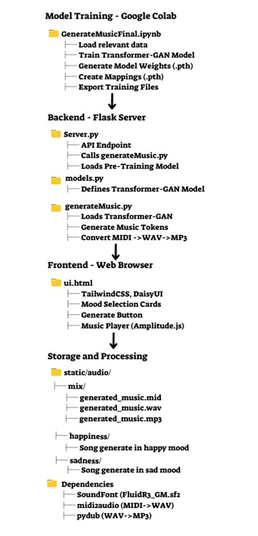
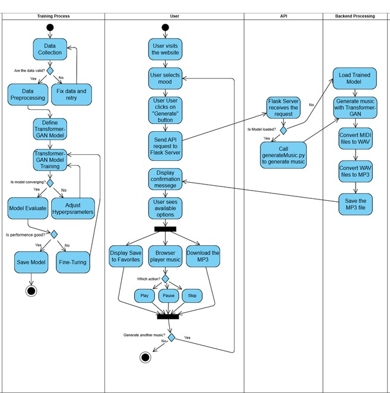

# MUSIC Project Overview

The **MUSIC** project is a deep learning-driven music creation system composed of two main parts. This guide details the overall architecture, file responsibilities, and required dependencies to help you set up, train, and deploy the project.

---

## Table of Contents

1. [Project Introduction](#project-introduction)  
2. [Part 1: GenerateMusicFinal.ipynb](#part-1-generatemusicfinalipynb)  
3. [Part 2: Python Project – MUSIC](#part-2-python-project--music)  
   - [server.py](#serverpy)  
   - [models.py](#modelspy)  
   - [generateMusic.py](#generatemusicpy)  
   - [templates/ui.html](#templatesuihtml)  
4. [Dependencies and Environment Setup](#dependencies-and-environment-setup)  
5. [Troubleshooting and FAQs](#troubleshooting-and-faqs)  
6. [Summary](#summary)

---

## Large Files

Some of the large files used in this project (such as models and sound files) are not stored in this repository.  
You can download them directly from the following link:  
[Large Files on Google Drive](https://drive.google.com/drive/folders/1r2kR42Y_4moMoy6O8Va-gE2kJvPyyM-K?usp=sharing)
> **Note:** The entire folder should be placed inside the `mymusic` directory for the code to work. The song database is also located here and is named finalzip.zip.

## Project Introduction

Below is a high-level overview of our project's architecture and workflow, depicted in two diagrams. The first diagram illustrates the main components—ranging from model training in Google Colab, through the Flask server, to the frontend interface and the storage/processing layer. The second diagram provides a step-by-step view of the entire process: from data collection and model training, to user interactions with the web interface, and finally to how the Flask API and backend processing generate and deliver the final music output.
### Diagram 1 - Architecture Overview

### Diagram 2 - Step-by-Step Workflow

The **MUSIC** project is composed of two central parts:

### Part 1: GenerateMusicFinal.ipynb

A Jupyter Notebook designed to run on Google Colab, which leverages powerful GPUs and large memory capacity to train the music generation model and produce MIDI outputs. This notebook is responsible for:

- **Training the Transformer-GAN model.**  
- **Generating essential output files** (e.g., weights, token mappings, and training data).

### Part 2: Python Project – MUSIC

This part includes:

- A Flask-based server and user interface.  
- The music generation script (convertible into MIDI, WAV, and MP3 files) running in standard Python code outside of Colab.  
- Integration of the generated audio into a web interface for user interaction (playback, download, etc.).

---

## Part 1: GenerateMusicFinal.ipynb

This notebook is used for training the music generation model on Google Colab. Key points include:

### Purpose
- **Train the music generation model.**  
- **Create essential output files:**
  - `note_to_int.pkl`
  - `int_to_note.pkl`
  - `best_model_Gloss_0.0319.pth` (example weights file)
  - `training_target.pkl`

### Usage
- **Run this notebook** to generate or improve the training data.  
- Once executed, **load these files** to either continue training or evaluate the model’s output.

### Important Note
To avoid wasting computational resources, **run the training code on the CPU** up to the training stage and save these files.  
Then, **switch to the GPU** to load the saved files and start training immediately.  
Only the **training phase** (which uses deep learning libraries optimized for parallel processing) can fully exploit GPU capabilities.

Please note that in the training code (GenerateMusicFinal.ipynb), some sections are commented out. The first sections refer to the larger model we created, which requires more powerful hardware and additional time to train. As such, they are documented for those who have the necessary resources. Additionally, there are parts of the notebook dedicated to uploading a weights file and continuing from that point for further training or evaluation, and these are also documented accordingly.

---

## Part 2: Python Project – MUSIC

This part of the project covers both the backend and user interface:

### server.py

- **Flask Server Initialization:**  
  Acts as the entry point for running the Flask server that handles HTTP requests.

- **HTML Page Serving:**  
  Provides access to `ui.html` so users can interact with the application via their web browser.

- **Music Generation API:**  
  Defines endpoints (e.g., `/generate`) that trigger actions (like printing “hello” or generating music) and return JSON responses.

- **Port Configuration:**  
  The server runs on port `5003`, allowing both local and external access.

### models.py

This file defines our neural network models used in music generation:

#### SmallMusicGenerator – Music Generator 🎶

- **Architecture:**  
  A Transformer-based model that receives a sequence of musical tokens and predicts the next tokens.

- **Key Components:**  
  - **Embedding Layer:** Converts input indices to vectors.  
  - **Positional Encoding:** Adds positional information.  
  - **Transformer Encoder:** Processes data through multiple layers.  
  - **Final Linear (fc) Layer:** Converts latent representations back to predictions over the vocabulary.

#### SmallMusicDiscriminator – Music Discriminator 🧐

- **Architecture:**  
  A multi-layer perceptron (MLP) designed to differentiate between real music (from training data) and music generated by the generator.

- **Key Components:**  
  - **Embedding Layer:** Converts tokens into vectors.  
  - **Fully Connected Layers:** Use linear transformations, LeakyReLU activations, and dropout to reduce dimensions.  
  - **Output Layer:** Produces a single output value indicating authenticity.

**Bottom Line:**  
The generator creates music, while the discriminator evaluates whether the generated music “sounds real.”  
These models are combined in a GAN-like setup for AI-based music generation.

### generateMusic.py

This script is responsible for generating music from the trained models:

#### Key Functions

1. **Loading Models and Mappings (`load_models_and_mappings()`)**  
   - Loads mapping files (`note_to_int.pkl` and `int_to_note.pkl`) using pickle.  
   - Initializes the generator and discriminator models.  
   - Loads pre-trained weights from a checkpoint and sets the models to evaluation mode.

2. **Generating a Music Sequence (`generate_sequence(...)`)**  
   - Randomly selects a seed sequence from training inputs.  
   - Uses the generator to extend the seed to a desired length (e.g., 500 tokens).  
   - The `temperature` parameter controls the diversity of the output.

3. **Converting Tokens to a Music21 Stream**  
   - **`token_to_music21(token)`:** Converts textual tokens (e.g., `NOTE_C4_1`, `CHORD_60.64_2`) into corresponding music21 objects (`Note`, `Chord`, or `Rest`).  
   - **`build_music21_stream(token_sequence)`:** Constructs a `music21.Stream` from the token sequence.  
     - The first three tokens define the tempo, key, and time signature.

4. **Exporting and Converting the Music File**  
   - Saves the `music21` stream as a MIDI file in `static/audio/mix/generated_music.mid`.  
   - Converts the MIDI file to WAV using FluidSynth (via `midi2audio`), requiring a valid SoundFont (e.g., `FluidR3_GM.sf2`).  
   - Converts the WAV file to MP3 using `pydub`.

#### Main Workflow

- Load models and mappings.  
- Randomly select a seed sequence.  
- Generate a new music sequence.  
- Create a MIDI file from the generated tokens.  
- Convert the MIDI file to WAV and then to MP3.  

This script serves as the backbone for running our Transformer-GAN-based music generation process.

### templates/ui.html

The `ui.html` file provides an interactive user interface for music generation using modern web technologies:

#### Key Components

- **Design Libraries:**
  - **TailwindCSS & DaisyUI:**  
    For responsive and modern UI design.
  - **Amplitude.js:**  
    For managing audio playback and playlists.

- **Page Structure:**
  1. **Navigation & Menus:**  
     A top navigation bar with links (e.g., Playlist, Favorite, Blog) and a left-side menu showing search history (loaded from localStorage).
  2. **Mood Selection:**  
     Cards for various moods (e.g., Happiness, Sadness, Angry, Fear). Selecting a mood highlights the corresponding card and animates the “Generate” button.
  3. **Music Player (Amplitude.js):**  
     Displays song details (cover art, name, artist, album) and controls (play/pause, previous, next, download).
  4. **Music Generation:**  
     On clicking “Generate”:  
     - Checks if a mood is selected.  
     - Stops any currently playing song.  
     - Chooses a song URL based on the mood.  
     - Initializes Amplitude.js with the selected song.
  5. **Favorites & Downloads:**  
     Users can add songs to favorites (stored in localStorage) and download the generated MP3 file.

**Summary:**  
The web interface allows users to select a mood, generate music accordingly, play it via Amplitude.js, view their search history, and download their favorite tracks. It combines responsive design with dynamic audio playback for an engaging experience.

---

# Dependencies and Environment Setup

## Python Version
**Python 3.10 or 3.11**  
Ensure you're not using Python 3.13, as many packages (like PyTorch) are not yet compatible.

---

## Virtual Environment Setup
Create and activate a virtual environment to isolate dependencies:
python3.11 -m venv myenv
source myenv/bin/activate

---

## To run the server (server.py), ensure that Flask is installed.
You can install it by running:
pip install flask

## Python Package Dependencies
Install the following packages:

### numpy
Install a version below 2 to avoid compatibility issues:
pip install "numpy<2"

### torch, torchvision, torchaudio
Install using the official PyTorch CPU wheels (adjust if GPU support is required):
pip install torch torchvision torchaudio --index-url https://download.pytorch.org/whl/cpu

### music21
For processing and converting music data:
pip install music21

### midi2audio
For converting MIDI files to WAV using FluidSynth:
pip install midi2audio

### pydub
For converting WAV files to MP3:
pip install pydub

---

## External Dependencies

### FluidSynth
FluidSynth is used by midi2audio for MIDI to WAV conversion.  
On macOS, install via Homebrew:
brew install fluidsynth

### SoundFont
You must provide a valid SoundFont file (e.g., `FluidR3_GM.sf2`). Ensure the path is correctly specified in your code.

### ffmpeg
Required by pydub for audio processing.  
On macOS, install via Homebrew:
brew install ffmpeg

---

## Additional Notes

### Virtual Environment
Make sure the virtual environment is activated before installing any packages.

### Dependency Conflicts
If you encounter issues with pip’s externally-managed environment, consider using flags like `--legacy-peer-deps` or adjust your pip configuration.

---

# Troubleshooting and FAQs

## Common Issues

### File Loading Errors
Ensure all files in the `requiredFiles` folder exist and paths are correct.

### Dependency Problems
Double-check that all required Python libraries are installed in your activated virtual environment.

### Conversion Errors
Verify FluidSynth installation and the availability of a valid SoundFont.  
Confirm that `static/audio/mix` exists for storing generated files.

### Web Integration Issues
Ensure your Flask server is running and that endpoint paths in `ui.html` match those defined in `server.py`.

---

## Summary

This redeem guide provides detailed instructions on:

- Setting up the environment and verifying dependencies.
- Running the Python script to generate music using a Transformer-GAN.
- Integrating the music generation process with a web interface for seamless user interaction.
- Addressing common issues and troubleshooting problems.

By following these instructions and ensuring all dependencies are correctly installed and configured, you can train your model on powerful GPU resources via Google Colab (Part 1) and deploy a complete server and user interface for music generation (Part 2) on your local machine.

**Enjoy creating music with your Transformer-GAN project!**

